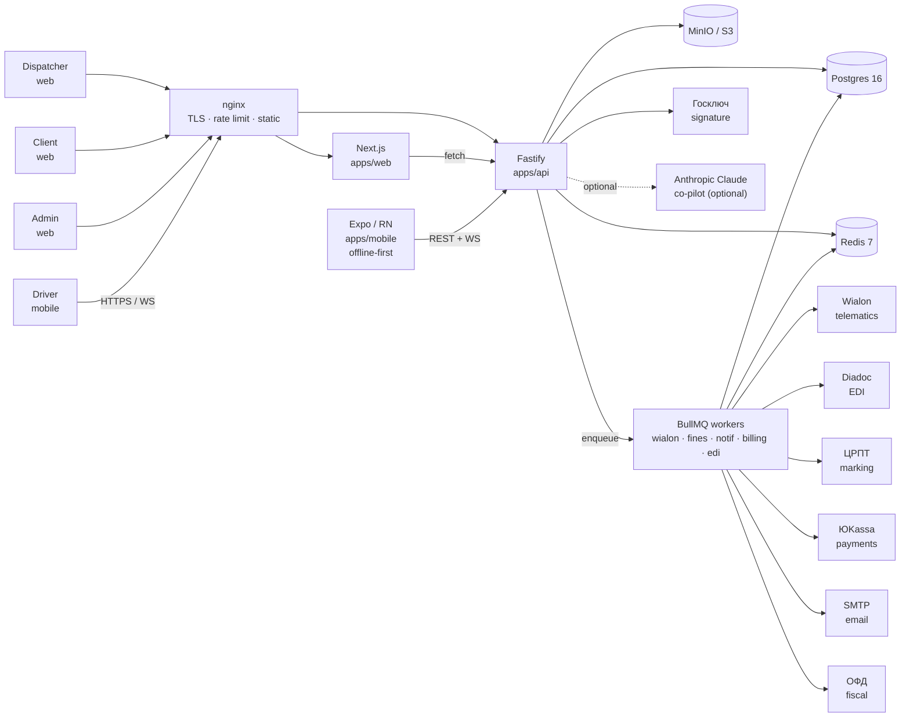
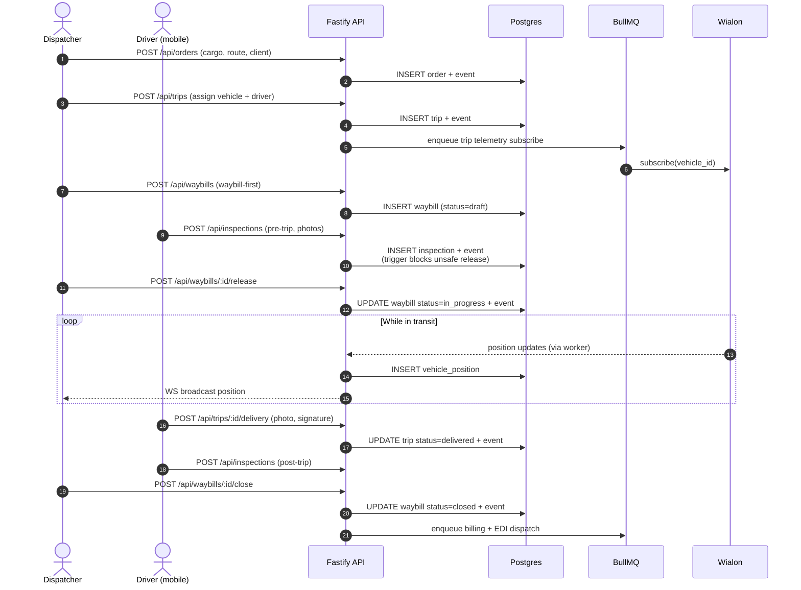
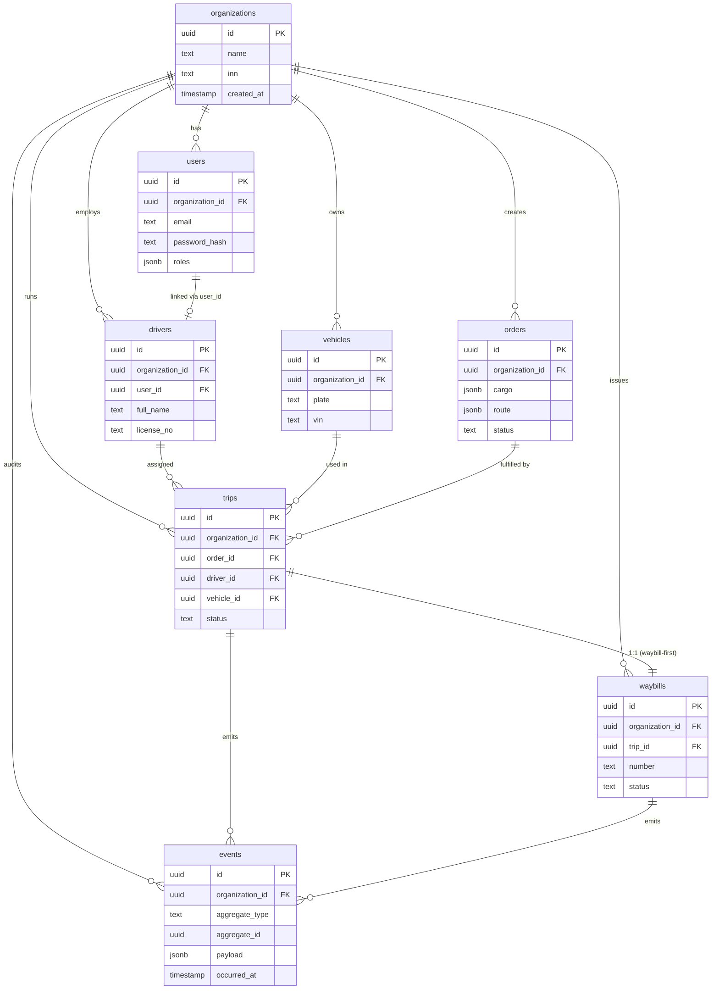

# TMS — System at a Glance

This is the **single-page** architectural picture: who talks to what, how data flows through a typical trip, and what the core entities look like.

For deeper dives, jump to [Where to read more](#where-to-read-more).

---

## 1. High-level component diagram

---

## 2. Core operational flow: order → trip → delivery → close

---

## 3. Core entities (compact ER)

> The `events` table is append-only at the DB level — see [ADR-0003](./adr/0003-append-only-event-journal.md).

---

## Where to read more

- [`docs/operations/wave-summary.md`](../operations/wave-summary.md) — chronological build history (waves 1–6 + rounds 1–3).
- [`docs/architecture/overview.md`](./overview.md) — older system snapshot (kept for context; supersedes by this doc).
- [`docs/architecture/operational-core-v2.md`](./operational-core-v2.md) — deep dive on the order → trip → waybill model.
- [`docs/architecture/adr/`](./adr/) — Architectural Decision Records (numbered, immutable).
- [`docs/api/openapi.md`](../api/openapi.md) — full REST API surface (296 routes).
